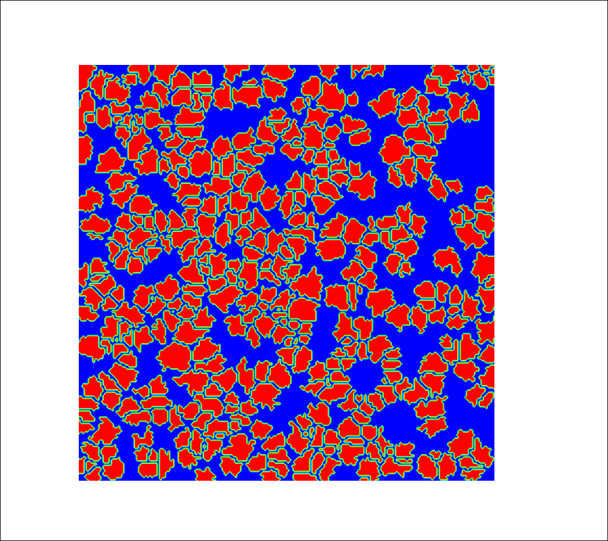
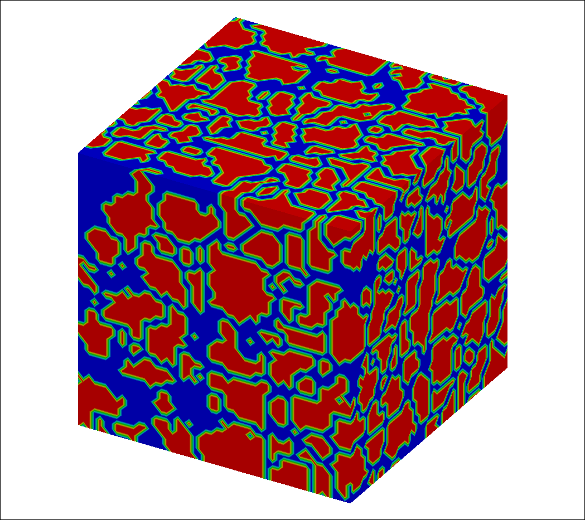

# About The Project
This project code can generate random porous media with Quartet Structure Generation Set (QSGS) method. QSGS was first proposed by Wang and his collaborators[1](#refer-1). Then he further enriched this method at 2007[2](#refer-2) and 2009[3](#refer-3).

## References

[1] Wang, M., Wang, J., Pan, N., & Chen, S. (2007). Mesoscopic predictions of the effective thermal conductivity for microscale random porous media.  Physical Review E - Statistical, Nonlinear, and Soft Matter Physics, 75(3), 036702. (https://doi.org/10.1103/PhysRevE.75.036702)

[2] Wang, M., Meng, F., & Pan, N. (2007). Transport properties of functionally graded materials. Journal of Applied Physics, 102(3), 1–7. (https://doi.org/10.1063/1.2767629)

[3] Wang, M., & Kang, Q. (2009). Electrokinetic transport in microchannels with random roughness. Analytical Chemistry, 81(8), 2953–2961. (https://doi.org/10.1021/ac802569n)

# Run the code
The most of this project is based on the C++ standard library. 

The method **output2png** of Class **Porous2D** and **Porous3D** can generate PNG file directly, which is base on the **GnuPlot** and **gnuplot-iostream**. If you need this function, make sure to install **GnuPlot** and **Boost C++ library** on your system. If you don't need, just comment the related code.

The method **output2tecplot** of Class **Porous2D** and **Porous3D** can generate plt file for [Tecplot](https://www.tecplot.com/).

## How to run
1. Clone the repo

    git clone https://github.com/huiselilun/GenPorMed.git

2. Compile

    make

3. Run

    ./run

# License
Distributed under the GPL v3.0 License.

# Examples
2D porous figure

3D porous figure

